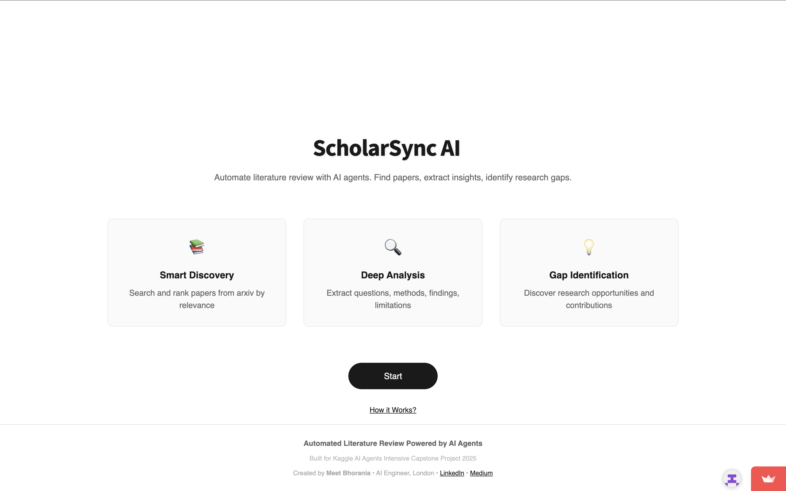
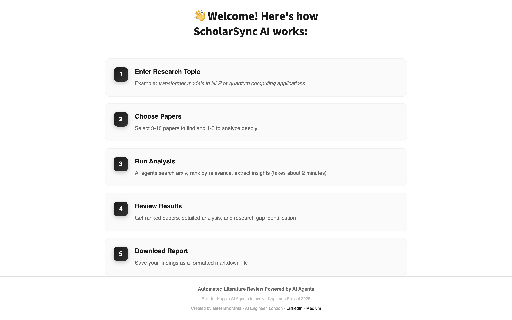
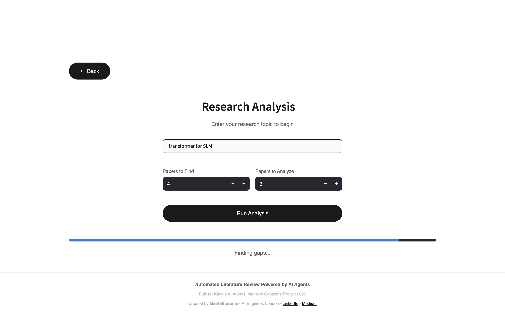

# 🔬 ScholarSync AI - Automated Literature Review System

**Kaggle AI Agents Intensive Capstone Project 2024**

[](https://scholarsync-research-agent-n83jpseppwxahsk7pw9oj7.streamlit.app)
[](https://github.com/meetbhorania/scholarSync-research-agent)

---

## 📋 Table of Contents
- [Problem Statement](#-problem-statement)
- [Solution](#-solution)
- [Screenshots](#-screenshots)
- [Architecture](#-architecture)
- [Features](#-features)
- [Tech Stack](#-tech-stack)
- [Installation & Setup](#-installation--setup)
- [Usage](#-usage)
- [Demo Video](#-demo-video)
- [Project Structure](#-project-structure)
- [Future Enhancements](#-future-enhancements)
- [Author](#-author)

---

## 🎯 Problem Statement

Academic researchers face significant challenges when conducting literature reviews:

- **Time-Consuming**: Manually searching and reading hundreds of papers takes weeks or months
- **Information Overload**: Difficult to identify the most relevant papers from thousands of results
- **Analysis Burden**: Extracting key information (methodology, findings, limitations) is tedious
- **Gap Identification**: Synthesizing multiple papers to find research gaps requires deep expertise
- **Inconsistency**: Manual reviews often miss important papers or insights

**Result**: Literature reviews become a bottleneck in research, delaying innovation and discovery.

---

## 💡 Solution

**ScholarSync AI** is an intelligent multi-agent system that automates the entire literature review process using advanced AI agents powered by Google Gemini 2.0 Flash.

### How It Works:

1. **Input**: Researcher enters a research topic (e.g., "transformer models in NLP")
2. **Automated Processing**: Three specialized AI agents work sequentially:
   - Agent 1: Searches and ranks relevant papers
   - Agent 2: Analyzes each paper in depth
   - Agent 3: Identifies research gaps and opportunities
3. **Output**: Comprehensive report with ranked papers, analysis, and research gaps
4. **Time Saved**: What takes weeks manually now takes ~2 minutes

### Value Proposition:
- ⏱️ **95% time reduction** in literature review
- 🎯 **Higher quality insights** through AI-powered analysis
- 📊 **Structured output** ready for research proposals
- 🔄 **Reproducible** and consistent results

---

## 📸 Screenshots

### Home Page
Clean, minimal interface with feature cards highlighting the three-agent system



### Interactive Tutorial
First-time user onboarding modal with 5-step workflow explanation and blurred background



### Analysis in Progress
Real-time progress tracking with status updates during paper search, ranking, and analysis



### Results Page
Comprehensive output with expandable sections for ranked papers, detailed analysis, and research gaps


---

## 🏗️ Architecture

### Multi-Agent System Design
```
┌─────────────────────────────────────────────────────────┐
│                     USER INPUT                          │
│              (Research Topic + Parameters)              │
└─────────────────┬───────────────────────────────────────┘
                  │
                  ▼
┌─────────────────────────────────────────────────────────┐
│           AGENT 1: Literature Scout                     │
│  ┌───────────────────────────────────────────────────┐  │
│  │ • Searches arxiv.org for relevant papers          │  │
│  │ • Uses semantic search with topic keywords        │  │
│  │ • Retrieves paper metadata (title, authors, URL)  │  │
│  │ • Ranks papers by relevance using Gemini 2.0     │  │
│  └───────────────────────────────────────────────────┘  │
└─────────────────┬───────────────────────────────────────┘
                  │ (Top N ranked papers)
                  ▼
┌─────────────────────────────────────────────────────────┐
│           AGENT 2: Paper Analyzer                       │
│  ┌───────────────────────────────────────────────────┐  │
│  │ • Downloads full paper PDFs from arxiv            │  │
│  │ • Extracts text from PDFs using PyPDF2            │  │
│  │ • Analyzes each paper using Gemini 2.0 to extract:│  │
│  │   - Research question                             │  │
│  │   - Methodology                                   │  │
│  │   - Key findings                                  │  │
│  │   - Limitations                                   │  │
│  │   - Future work suggestions                       │  │
│  └───────────────────────────────────────────────────┘  │
└─────────────────┬───────────────────────────────────────┘
                  │ (Detailed analysis of each paper)
                  ▼
┌─────────────────────────────────────────────────────────┐
│        AGENT 3: Research Gap Analyzer                   │
│  ┌───────────────────────────────────────────────────┐  │
│  │ • Synthesizes findings across all papers          │  │
│  │ • Identifies common themes and patterns           │  │
│  │ • Compares divergent approaches                   │  │
│  │ • Discovers research gaps and opportunities       │  │
│  │ • Proposes novel research directions              │  │
│  │ • Suggests potential contributions                │  │
│  └───────────────────────────────────────────────────┘  │
└─────────────────┬───────────────────────────────────────┘
                  │
                  ▼
┌─────────────────────────────────────────────────────────┐
│                  STRUCTURED OUTPUT                      │
│  • Ranked paper list with links                         │
│  • Individual paper analyses                            │
│  • Research gap identification                          │
│  • Downloadable markdown report                         │
└─────────────────────────────────────────────────────────┘
```

### Agent Communication Flow
```
User Query → Literature Scout → Paper Analyzer → Gap Analyzer → Final Report
     ↓              ↓                  ↓                ↓              ↓
  Topic    →   Paper URLs   →    Summaries    →    Synthesis  →   Download
```

### Technology Stack Integration
```
┌─────────────────────────────────────────────┐
│         Frontend: Streamlit                 │
│  • User interface with tutorial system      │
│  • Real-time progress tracking              │
│  • Interactive results display              │
└──────────────┬──────────────────────────────┘
               │
               ▼
┌─────────────────────────────────────────────┐
│    AI Layer: Google Gemini 2.0 Flash        │
│  • Natural language understanding           │
│  • Semantic ranking                         │
│  • Content extraction & analysis            │
│  • Gap identification                       │
└──────────────┬──────────────────────────────┘
               │
               ▼
┌─────────────────────────────────────────────┐
│      Data Sources: arxiv.org API            │
│  • Academic paper repository                │
│  • PDF downloads                            │
│  • Metadata extraction                      │
└─────────────────────────────────────────────┘
```

---

## ✨ Features

### Core Functionality
- 🔍 **Intelligent Paper Search**: Searches arxiv.org and retrieves relevant academic papers
- 🎯 **AI-Powered Ranking**: Uses Gemini 2.0 Flash to rank papers by relevance to the research topic
- 📄 **Deep Paper Analysis**: Automatically downloads PDFs and extracts key information from each paper
- 💡 **Research Gap Identification**: Synthesizes findings to identify unexplored research opportunities
- 📥 **Report Generation**: Creates downloadable markdown reports with all findings

### User Experience
- 🎨 **Clean, Minimal UI**: Professional interface with smooth animations and pill-shaped buttons
- 📊 **Real-Time Progress**: Live progress bar and status updates during analysis
- 🔄 **Rotating Examples**: Dynamic placeholder text showing example research topics every 2 seconds
- 📖 **Interactive Tutorial**: 
  - Auto-shows on first visit with blurred background modal
  - "How it Works?" link to reopen anytime
  - 5-step walkthrough of the complete workflow
- 📱 **Responsive Design**: Works seamlessly on desktop and mobile
- ✅ **Smart Input Validation**: Red border feedback for empty topic input

### Advanced Features
- ⚡ **Fast Processing**: Complete analysis in ~2 minutes using Gemini 2.0 Flash
- 🔗 **Direct PDF Links**: One-click access to original papers
- 📋 **Structured Output**: Organized sections for easy navigation
- 🎯 **Customizable Parameters**: Choose number of papers to find and analyze
- 📝 **Automated PDF Processing**: Downloads and extracts text from academic PDFs

---

## 🛠️ Tech Stack

### Core Technologies
- **Frontend**: Streamlit 1.28+
- **AI/ML**: Google Gemini 2.0 Flash (via `google-generativeai`)
- **Data Source**: arxiv.org API (via `arxiv` Python package)
- **PDF Processing**: PyPDF2
- **Environment Management**: python-dotenv

### Libraries & Tools
```python
streamlit>=1.28.0
google-generativeai>=0.3.0
arxiv>=2.0.0
PyPDF2>=3.0.0
python-dotenv>=1.0.0
requests>=2.31.0
streamlit-autorefresh>=0.0.1
```

### Deployment
- **Platform**: Streamlit Cloud (Free tier)
- **Version Control**: Git/GitHub
- **CI/CD**: Automatic deployment on push to main branch

---

## 📦 Installation & Setup

### Prerequisites
- Python 3.9 or higher
- Google Gemini API key ([Get one free here](https://makersuite.google.com/app/apikey))
- Git (for cloning)

### Step 1: Clone Repository
```bash
git clone https://github.com/meetbhorania/scholarSync-research-agent.git
cd scholarSync-research-agent
```

### Step 2: Create Virtual Environment
```bash
# Create virtual environment
python -m venv venv

# Activate virtual environment
# On Windows:
venv\Scripts\activate
# On macOS/Linux:
source venv/bin/activate
```

### Step 3: Install Dependencies
```bash
pip install -r requirements.txt
```

### Step 4: Configure Environment Variables
Create a `.env` file in the project root:
```bash
GEMINI_API_KEY=your_gemini_api_key_here
```

### Step 5: Run the Application
```bash
streamlit run app.py
```

The app will open in your browser at `http://localhost:8501`

---

## 🚀 Usage

### Quick Start

1. **Open the App**: Visit the [live demo](https://scholarsync-research-agent-n83jpseppwxahsk7pw9oj7.streamlit.app) or run locally

2. **View Tutorial (First Time)**: Tutorial automatically appears on first visit explaining the 5-step workflow

3. **Click "Start"**: From the home page, click the Start button to begin

4. **Enter Research Topic**: 
   - Example: "transformer models in NLP"
   - Example: "quantum computing applications"
   - Example: "deep learning for medical imaging"
   - *Tip: Watch the rotating placeholder for more examples*

5. **Configure Parameters**:
   - **Papers to Find**: 3-10 (number of papers to search)
   - **Papers to Analyze**: 1-3 (number to analyze in depth)

6. **Run Analysis**: Click "Run Analysis" and wait ~2 minutes

7. **Review Results**: 
   - Browse ranked papers with direct PDF links
   - Read detailed analyses with extracted summaries
   - Explore identified research gaps
   - Download the complete markdown report

### Example Workflow
```
Input: "reinforcement learning in robotics"
Parameters: Find 5 papers, Analyze 2

Output:
├── 📚 Ranked Papers (5 papers with links)
├── 📄 Analysis (2 detailed paper summaries)
│   ├── Paper 1: Research question, methodology, findings, limitations
│   └── Paper 2: Research question, methodology, findings, limitations
└── 💡 Research Gaps
    ├── Common themes across papers
    ├── Divergent approaches
    ├── Identified research gaps
    ├── Proposed research directions
    └── Novel contribution opportunities

Download: Markdown report with all findings
```

---

## 🎥 Demo Video

[**Watch Full Demo on YouTube/Loom**](#) *(Add your video link here)*

**Video Contents** (3-5 minutes):
- Problem introduction
- Solution walkthrough
- Live demonstration
- Results showcase
- Architecture explanation

---

## 📁 Project Structure
```
scholarSync-research-agent/
│
├── app.py                          # Main Streamlit application
│
├── agents/                         # AI Agent modules
│   ├── __init__.py
│   ├── literature_scout.py         # Agent 1: Paper search & ranking
│   ├── paper_analyzer.py           # Agent 2: Deep paper analysis (PDF processing)
│   └── research_gap_analyzer.py    # Agent 3: Gap identification
│
├── assets/                         # Screenshots and diagrams
│   ├── home-page.png
│   ├── tutorial-modal.png
│   ├── progress-bar.png
│   └── results-page.png
│
├── requirements.txt                # Python dependencies
├── .env                            # Environment variables (not in git)
├── .env.example                    # Example environment variables
├── .gitignore                      # Git ignore rules
│
└── README.md                       # This file
```

---

## 🔮 Future Enhancements

### Planned Features
- 📚 **Multiple Data Sources**: Add support for PubMed, IEEE Xplore, Google Scholar
- 🌍 **Multi-Language Support**: Analyze papers in multiple languages
- 💾 **Save & Resume**: Allow users to save searches and continue later
- 👥 **Collaboration**: Share reports with team members
- 📊 **Citation Analysis**: Track paper citations and impact
- 🤖 **Advanced AI Models**: Support for Claude, GPT-4, and other LLMs
- 📈 **Trend Analysis**: Identify trending topics over time
- 🔔 **Alert System**: Notify users of new relevant papers

### Potential Improvements
- Enhanced PDF parsing for complex layouts (tables, figures)
- Support for analyzing code repositories linked in papers
- Integration with reference managers (Zotero, Mendeley)
- Export to LaTeX, Word, and other formats
- Batch processing for multiple research topics

---

## 👨‍💻 Author

**Meet Bhorania**  
AI Engineer | London, UK

- 🎓 BEng Computer Science (First Class Honours) - Anglia Ruskin University, 2024
- 🏆 Google DeepMind AI Research Foundations Program Graduate
- 💼 Former Co-Founding AI Engineer at PreVu
- 🔬 Experience in LLM fine-tuning, multi-agent systems, and production ML deployment

**Connect with me:**
- 📧 Email: [meet.bhorania@gmail.com](mailto:meet.bhorania@gmail.com)
- 💼 LinkedIn: [linkedin.com/in/meetbhorania](https://www.linkedin.com/in/meetbhorania)
- 🐙 GitHub: [github.com/meetbhorania](https://github.com/meetbhorania)
- ✍️ Medium: [medium.com/@meet.bhorania](https://medium.com/@meet.bhorania)

---

## 📄 License

This project is part of the Kaggle AI Agents Intensive Capstone Project 2024.

---

## 🙏 Acknowledgments

- **Kaggle** for organizing the AI Agents Intensive program
- **Google** for providing Gemini API access and AI Research Foundations training
- **arxiv.org** for open academic paper repository
- **Streamlit** for the excellent web framework
- **Open source community** for the amazing tools and libraries

---

## 📞 Support

If you encounter any issues or have questions:

1. **Check Documentation**: Review the [Installation & Setup](#-installation--setup) section
2. **Usage Guide**: Read through the [Usage](#-usage) guide
3. **Environment Setup**: Ensure your GEMINI_API_KEY is correctly set in .env file
4. **GitHub Issues**: Open an issue on [GitHub](https://github.com/meetbhorania/scholarSync-research-agent/issues)
5. **Direct Contact**: Reach out via email at [meet.bhorania@gmail.com](mailto:meet.bhorania@gmail.com)

---

**Built with ❤️ from Meet Bhorania for the research community | Powered by Google Gemini 2.0 Flash**
